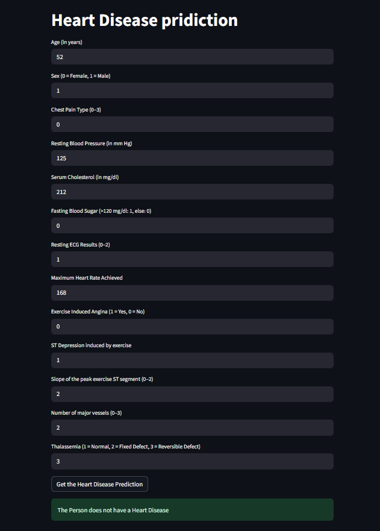

# ❤️ Heart Disease Prediction using Logistic Regression (from Scratch & Deployment)

An end-to-end project implementing **logistic regression from scratch** for predicting heart disease, achieving **85% training accuracy** and **80% test accuracy**, and deployed with **Streamlit** for real-time user predictions.

---

## 📑 Table of Contents
- [Overview](#overview)  
- [Problem Statement](#problem-statement)  
-  [Dataset](#dataset)  
- [Project Structure](#project-structure)  
- [Tools & Technologies](#tools--technologies)  
- [Methods](#methods)  
- [Key Insights](#key-insights)  
- [Model & Outputs](#model--outputs)  
- [How to Run This Project](#how-to-run-this-project)  
- [Results & Conclusion](#results--conclusion)  
- [Future Work](#future-work)  
- [Author & Contact](#author--contact)  

---

## 📖 Overview
This project aims to predict whether a person has heart disease based on clinical features such as age, cholesterol level, blood pressure, and more.  
The workflow includes **data preprocessing, logistic regression (implemented from scratch), model evaluation, and deployment**.

---

## ❓ Problem Statement
- Heart disease is one of the leading causes of death worldwide.  
- Accurate and early prediction of heart disease can assist healthcare professionals in decision-making and treatment planning.  
- This project builds a **predictive ML model from scratch** and provides a **user-friendly web interface** for predictions.

---

## 📊 Dataset
- **Source:** UCI Heart Disease Dataset (via Kaggle/online repositories)  
- **Features:**  
  - Age, Sex, Chest Pain Type, Resting BP, Cholesterol, Fasting Blood Sugar, Resting ECG, Max Heart Rate, Exercise Angina, Oldpeak, Slope, Number of vessels, Thalassemia  
- **Target:** `0 = No Disease`, `1 = Disease`

---
## 📂 Project Structure
```
Heart-Disease-Prediction/
│── Notebooks/
│ └── heart_disease_prediction.ipynb        # Training & analysis
│
│── Scripts/
│ └── streamlit_app.py                      # Streamlit deployment script
│
│── Outputs/
│ ├── cost_function_plot.png                # Training convergence visualization
│ └── trained_model.sav                     # Saved trained model
│
│── Images/
│ └── streamlit_app_screenshot.png          # App UI screenshot
│
│── Requirements.txt                        # Dependencies list
│── README.md # Project documentation
```
---

## 🛠 Tools & Technologies
- **Languages:** Python  
- **Libraries:** NumPy, Pandas, Matplotlib, scikit-learn, Streamlit  
- **Deployment:** Streamlit Web App  
- **Version Control:** Git & GitHub

---

## 🔎 Methods
1. **Data Loading & Exploration**  
   - Loaded dataset, checked data types, null values, and basic distributions.  

2. **Data Preprocessing**  
   - Standardized numerical features using StandardScaler.  

3. **Model Development (Logistic Regression from Scratch)**  
   - Implemented **Sigmoid function, Gradient Descent, and Cost Function** manually.  
   - Iteratively updated weights to minimize error.  

4. **Training & Evaluation**  
   - Achieved **85% accuracy on training set** and **80% on test set**.  
   - Cost function showed smooth convergence.  

5. **Model Saving & Deployment**  
   - Saved model using Pickle (`.sav` file).  
   - Built **Streamlit web app** for real-time predictions.  

---

## 📈 Key Insights
- Training Accuracy: **85%**  
- Test Accuracy: **80%**  
- Cost function plot shows **smooth convergence**, indicating stable training.  
- Features such as **age, chest pain type, cholesterol, and max heart rate** strongly influenced predictions.  

---

## 🤖 Model & Outputs
- **Cost Function Trend:**  
    

- **Streamlit UI Screenshot:**  
    

- **Pickle Model File:** `trained_model.sav`

---

## 🚀 How to Run This Project

### 🔧 Step 1: Clone Repository

```bash
git clone https://github.com/yourusername/heart-disease-prediction-python.git
cd heart-disease-prediction-python
```

### 🔧 Step 2: Install Dependencies

```bash
pip install -r Requirements.txt
```

### 🔧 Step 3: Run Jupyter Notebook (Optional, for training)

```bash
jupyter notebook Notebooks/heart_disease_prediction.ipynb
```

### 🔧 Step 4: Run Streamlit App

```bash
streamlit run Scripts/streamlit_app.py
```

--- 

### ✅ Results & Conclusion

- Successfully implemented logistic regression from scratch with competitive accuracy.
- Built an interactive web app for real-time predictions.
- Demonstrated the importance of data preprocessing and gradient descent optimization.

---

### 🔮 Future Work

- Improve accuracy with advanced models (Random Forest, XGBoost, Neural Nets).
- Hyperparameter tuning.
- Deployment on cloud platforms (Heroku/AWS/GCP) for public access.
- Enhanced UI with better visualizations and patient risk scoring.

---

### 👨‍💻 Author & Contact
**Golla Sai Deep**

Aspiring Data Scientist

📧 Email: saideepcct@gmail.com

🔗 LinkedIn: [Your LinkedIn Profile]

🔗 GitHub: [Your GitHub Profile]

